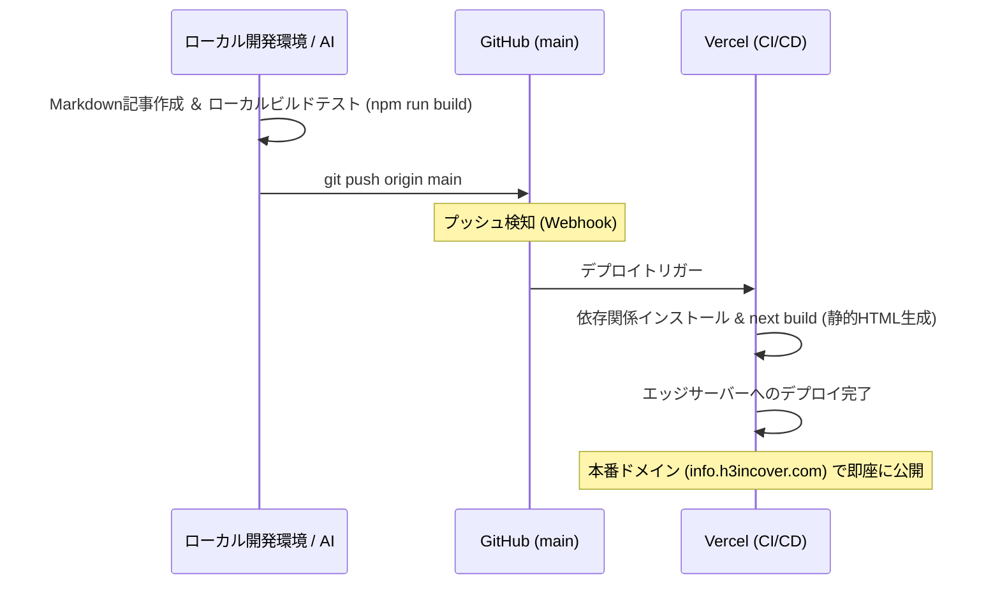

# システムアーキテクチャ (Architecture)

## システム構成
本システムは、Next.js（App Router）を基盤とした**静的サイトジェネレーター（SSG / Static Site Generation）**の仕組みを採用しています。データベースを持たず、ビルド時にすべてのMarkdownコンテンツを静的HTMLへと変換するため、高速なページ表示と高いセキュリティ、メンテナンスフリーな保守性を実現しています。

* **フレームワーク**: Next.js 15+ (App Router, Turbopack)
* **言語**: TypeScript
* **スタイリング**: Tailwind CSS v4 (vanilla CSSインテグレーション)
* **Markdownパーサー**: `marked` (フロントマターの処理には `gray-matter` を使用)
* **デプロイ・ホスティング**: Vercel

---

## ディレクトリ構成
プロジェクトの主要なファイル配置と役割は以下の通りです。

```text
info.h3incover.com/
├── .agents/                    # AIエージェント用のプロジェクト定義フォルダ
│   └── AGENTS.md               # エージェントが厳守すべき編集方針・記事構成ルール
├── docs/                       # プロジェクト設計・運用ドキュメント（本フォルダ）
├── public/                     # 静的アセット（画像、ファビコンなど）
│   └── images/
│       └── categories/         # カテゴリごとのデフォルトフォールバック画像
├── src/
│   ├── app/                    # Next.js App Router ページコンポーネント
│   │   ├── categories/         # カテゴリ一覧・カテゴリ別記事一覧
│   │   ├── posts/
│   │   │   └── [slug]/         # 記事詳細ページ（動的ルーティング / SSG）
│   │   ├── tags/               # タグ一覧・タグ別記事一覧
│   │   ├── globals.css         # グローバルスタイル定義 (Tailwind v4 読み込み含む)
│   │   ├── layout.tsx          # 共通レイアウト（ヘッダー、フッターの配置）
│   │   └── page.tsx            # トップページ
│   ├── components/             # 再利用可能なUIコンポーネント
│   │   ├── Footer.tsx          # リニューアルされたH3 Incover Networkリンク付きフッター
│   │   ├── ImageWithFallback.tsx # 画像読み込み失敗時の自動フォールバック画像コンポーネント
│   │   ├── OperatorDetails.tsx # 運営者・特商法表記のテーブル定義
│   │   └── TableOfContents.tsx # 記事本文のHeadingから生成される目次コンポーネント
│   ├── content/
│   │   └── posts/              # 記事のMarkdownファイル格納場所 (.md)
│   └── lib/
│       └── markdown.ts         # Markdownパース、メタデータ取得、記事一覧抽出等の共通ユーティリティ
└── tailwind.config.js          # Tailwind CSS 設定（v4で移行中、CSS側での制御を推奨）
```

---

## データの流れ (Data Flow)

### Markdownから公開までのデータの流れ
記事の追加からビルド、ページレンダリングに至るまでのデータフローを以下に示します。

```mermaid
graph TD
    A[Markdownファイル作成 <br> src/content/posts/*.md] --> B[ビルド実行 <br> npm run build]
    B --> C[lib/markdown.ts の実行]
    C --> C1[gray-matter によるフロントマター解析]
    C --> C2[marked による本文 Markdown -> HTML 変換]
    C --> C3[全記事一覧・メタデータのインデックス化]
    
    C1 --> D[動的SSGルーティング生成 <br> src/app/posts/[slug]/page.tsx]
    C2 --> D
    
    D --> E[静的HTMLファイルの生成]
    E --> F[Vercel Edge Network から配信]
```

### GitHub / Vercel 運用フロー


---

## 主要コンポーネント

### 1. `ImageWithFallback` ([ImageWithFallback.tsx](file:///c:/Projects/info.h3incover.com/src/components/ImageWithFallback.tsx))
記事ごとにアイキャッチ画像が設定されていない場合や、画像ファイルの指定が壊れてロードに失敗した際に、カテゴリ（例：`ai.png`, `care.png`, `web.png` など）に適合したカテゴリ別アセット、または汎用の `other.png` や `hero.jpg` に自動フォールバックさせるための頑健な画像読み込みコンポーネントです。

### 2. `Footer` ([Footer.tsx](file:///c:/Projects/info.h3incover.com/src/components/Footer.tsx))
H3 Incoverのサービスネットワーク（本体サイト、INFO、介護制度ポータル、介護ホームページサービス）への親和的かつスムーズな回遊を促進する、3カラムのグリッド型フッターです。ホバー時のリフトアップアニメーションが定義されています。

### 3. `TableOfContents` ([TableOfContents.tsx](file:///c:/Projects/info.h3incover.com/src/components/TableOfContents.tsx))
Markdown内の `h2` および `h3` 要素をパースし、自動でジャンプ可能な記事の「目次」を組み立てるコンポーネントです。

---

## 記事追加の流れ
1. **Markdown作成**: `src/content/posts/` 以下にフロントマターを含む `.md` ファイルを作成。
2. **メタデータ設定**: カテゴリ名（介護、Web、AIなど）やタグを正しくアサイン。
3. **ローカル確認**: 開発サーバー（`npm run dev`）で表示崩れやリンク切れを確認。
4. **ビルドテスト**: `npm run build` を実行して、エラーなく静的生成ができるか確認。
5. **Git公開**: GitHubへプッシュし、Vercel経由で本番へデプロイ。
